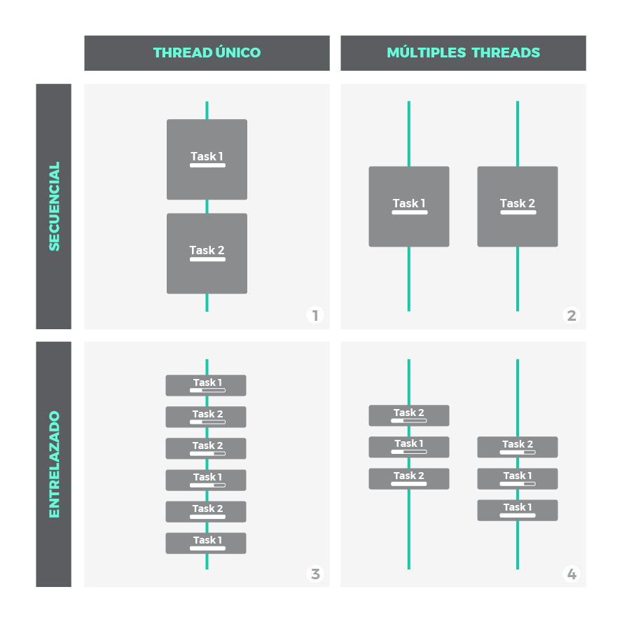

# Javascript Asíncrono: La guía definitiva  

**Nota:** Este repositorio esta basado en el post escrito por [LEMON_CODE](https://lemoncode.net/lemoncode-blog/2018/1/29/javascript-asincrono) "Javascript Asíncrono: La guía definitiva", con fin de dar a conocer a la comunidad por otro medio, los creditos son de [Javier Calzado](https://lemoncode.net/lemoncode-blog/?author=5a6f02025e0ed86ac9148029).

 
 
    
 

La asincronía es uno de los pilares fundamentales de Javascript. El objetivo de esta guía es profundizar en las piezas y elementos que la hacen posible. Teniendo claro estos conceptos, podrás ponerlos en práctica en tu código y escribir mejores aplicaciones.

Las explicaciones que encontrarás a continuación se apoyan gráficos sencillos pero muy ilustrativos, te ayudarán a asimilar muchas ideas. En primer lugar, trataremos conceptos generales previos como introducción a la programación asíncrona. A continuación, nos centraremos en el modelo de asincronía específico de Javascript y finalmente repasaremos los patrones asíncronos mas comunes en Javascript a través de ejemplos.

## Tabla de Contenidos
- [Concurrencia Y Paralelismo](#concurrencia-y-paralelismo)
- [Operaciones CPU-Bound vs. I/O-Bound](#operaciones-cpu-bound-vs-io-bound)
- [Naturaleza I/O: Bloqueante vs. No-bloqueante & Síncrono vs. Asíncrono](#naturaleza-io-bloqueante-vs-no-bloqueante--s%C3%ADncrono-vs-as%C3%ADncrono)
- [El Modelo de Javascript](#el-modelo-de-javascript)
  - [El Loop de Eventos de Javascript](#el-loop-de-eventos-de-javascript)
  - [Nota breve sobre Paralelismo](#nota-breve-sobre-paralelismo)
- [Patrones Asíncronos en Javascript](#patrones-as%C3%ADncronos-en-javascript)
  - [Callbacks](#callbacks)
  - [Promesas](#promesas)
  - [Async / Await](#async--await)
- [Resumen](#resumen)

# Concurrencia Y Paralelismo
Concurrencia y paralelismo son conceptos relacionados pero con un importante matiz de diferencia entre ellos. Es por esto que muy a menudo se confunden y se utilizan erróneamente. Vayamos al grano:
- **Concurrencia:** cuando dos o mas tareas progresan simultáneamente.
- **Paralelismo:** cuando dos o mas tareas se ejecutan, literalmente, a la vez, en el mismo instante de tiempo.
Nótese la diferencia: que varias tareas **progresen** simultáneamente no tiene porque significar que sucedan al mismo tiempo. Mientras que la concurrencia aborda un problema más general, el paralelismo es un sub-caso de la concurrencia donde las cosas suceden exactamente al mismo tiempo.

Mucha gente aún sigue creyendo que la concurrencia implica necesariamente más de un *thread*. **Esto no es cierto**. El entrelazado (o multiplexado), por ejemplo, es un mecanismo común para implementar concurrencia en escenarios donde los recursos son limitados. Piensa en cualquier sistema operativo moderno haciendo multitarea con un único core. Simplemente trocea las tareas en tareas más pequeñas y las entrelaza, de modo que cada una de ellas se ejecutará durante un breve instante. Sin embargo, a largo plazo, la impresión es que todas progresan a la vez.

Fíjate en el siguiente gráfico:

 
 
    
 

- **Escenario 1**: no es ni concurrente ni paralelo. Es simplemente una ejecución secuencial, primero una tarea, después la siguiente.
- **Escenario 2**, **3** y **4**: son escenarios donde se ilustra la concurrencia bajo distintas técnicas:
    1. **Escenario 3**: muestra como la concurrencia puede conseguirse con un único *thread*. Pequeñas porciones de cada tarea se entrelazan para que ambas mantengan un progreso constante. Esto es posible siempre y cuando las tareas puedan descompuestas en subtareas mas simples.
    2. **Escenario 2** y **4**: ilustran paralelismo, utilizando multiples *threads* donde las tareas o subtareas corren en paralelo exactamente al mismo tiempo. A nivel de *thread*, el escenario **2** es secuencial, mientras que **4** aplica entrelazado.

# Operaciones CPU-Bound vs. I/O-Bound
lorem
# Naturaleza I/O: Bloqueante vs. No-bloqueante & Síncrono vs. Asíncrono
lorem
# El Modelo de Javascript
lorem
## El Loop de Eventos de Javascript
lorem
## Nota breve sobre Paralelismo
lorem
# Patrones Asíncronos en Javascript
lorem
## Callbacks
lorem
## Promesas
lorem
## Async / Await
lorem
# Resumen

