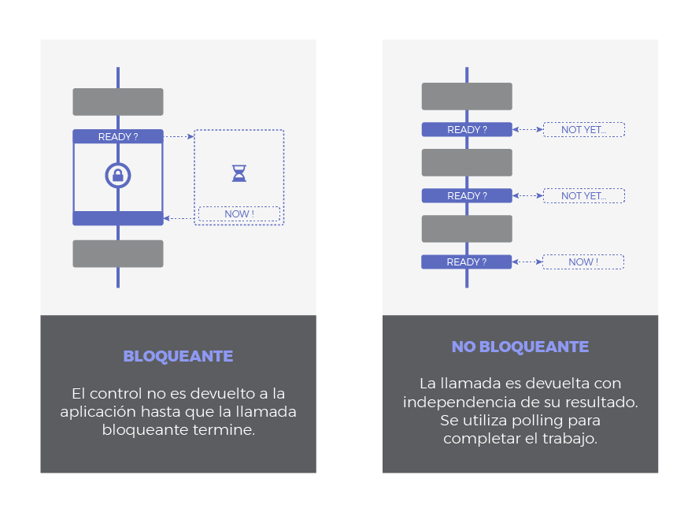
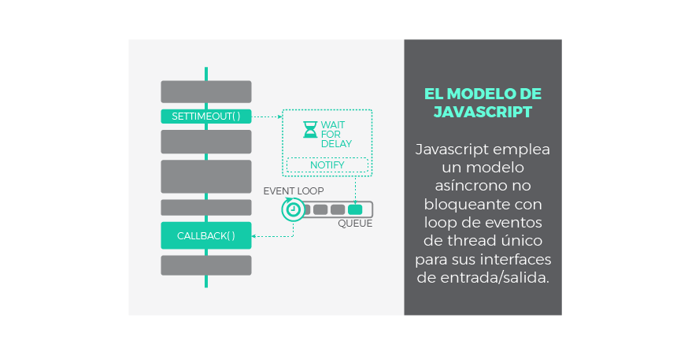
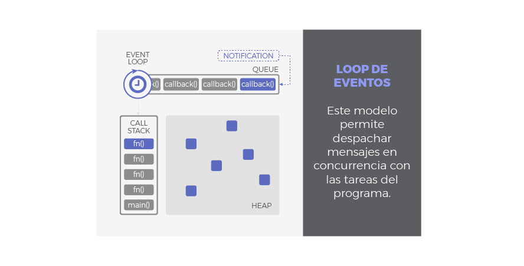

# Javascript Asíncrono: La guía definitiva  

**Nota:** Este repositorio esta basado en el post escrito por [Javier Calzado](https://lemoncode.net/lemoncode-blog/?author=5a6f02025e0ed86ac9148029) de [LEMON_CODE](https://lemoncode.net/lemoncode-blog/2018/1/29/javascript-asincrono) bajo el titular de "Javascript Asíncrono: La guía definitiva", con fin de dar a conocer a la comunidad por otro medio, los creditos le pertenecen al autor.

 <p align="center">
    
 </p>

La asincronía es uno de los pilares fundamentales de Javascript. El objetivo de esta guía es profundizar en las piezas y elementos que la hacen posible. Teniendo claro estos conceptos, podrás ponerlos en práctica en tu código y escribir mejores aplicaciones.

Las explicaciones que encontrarás a continuación se apoyan gráficos sencillos pero muy ilustrativos, te ayudarán a asimilar muchas ideas. En primer lugar, trataremos conceptos generales previos como introducción a la programación asíncrona. A continuación, nos centraremos en el modelo de asincronía específico de Javascript y finalmente repasaremos los patrones asíncronos mas comunes en Javascript a través de ejemplos.

## Tabla de Contenidos
- [Concurrencia Y Paralelismo](#concurrencia-y-paralelismo)
- [Operaciones CPU-Bound vs. I/O-Bound](#operaciones-cpu-bound-vs-io-bound)
- [Naturaleza I/O: Bloqueante vs. No-bloqueante & Síncrono vs. Asíncrono](#naturaleza-io-bloqueante-vs-no-bloqueante--s%C3%ADncrono-vs-as%C3%ADncrono)
- [El Modelo de Javascript](#el-modelo-de-javascript)
  - [El Loop de Eventos de Javascript](#el-loop-de-eventos-de-javascript)
  - [Nota breve sobre Paralelismo](#nota-breve-sobre-paralelismo)
- [Patrones Asíncronos en Javascript](#patrones-as%C3%ADncronos-en-javascript)
  - [Callbacks](#callbacks)
  - [Promesas](#promesas)
  - [Async / Await](#async--await)
- [Resumen](#resumen)


# Concurrencia Y Paralelismo
Concurrencia y paralelismo son conceptos relacionados pero con un importante matiz de diferencia entre ellos. Es por esto que muy a menudo se confunden y se utilizan erróneamente. Vayamos al grano:
- **Concurrencia:** cuando dos o mas tareas progresan simultáneamente.
- **Paralelismo:** cuando dos o mas tareas se ejecutan, literalmente, a la vez, en el mismo instante de tiempo.
Nótese la diferencia: que varias tareas **progresen** simultáneamente no tiene porque significar que sucedan al mismo tiempo. Mientras que la concurrencia aborda un problema más general, el paralelismo es un sub-caso de la concurrencia donde las cosas suceden exactamente al mismo tiempo.

Mucha gente aún sigue creyendo que la concurrencia implica necesariamente más de un *thread*. **Esto no es cierto**. El entrelazado (o multiplexado), por ejemplo, es un mecanismo común para implementar concurrencia en escenarios donde los recursos son limitados. Piensa en cualquier sistema operativo moderno haciendo multitarea con un único core. Simplemente trocea las tareas en tareas más pequeñas y las entrelaza, de modo que cada una de ellas se ejecutará durante un breve instante. Sin embargo, a largo plazo, la impresión es que todas progresan a la vez.

Fíjate en el siguiente gráfico:

 <p align="center">
    
 </p>

- **Escenario 1**: no es ni concurrente ni paralelo. Es simplemente una ejecución secuencial, primero una tarea, después la siguiente.
- **Escenario 2**, **3** y **4**: son escenarios donde se ilustra la concurrencia bajo distintas técnicas:
    1. **Escenario 3**: muestra como la concurrencia puede conseguirse con un único *thread*. Pequeñas porciones de cada tarea se entrelazan para que ambas mantengan un progreso constante. Esto es posible siempre y cuando las tareas puedan descompuestas en subtareas mas simples.
    2. **Escenario 2** y **4**: ilustran paralelismo, utilizando multiples *threads* donde las tareas o subtareas corren en paralelo exactamente al mismo tiempo. A nivel de *thread*, el escenario **2** es secuencial, mientras que **4** aplica entrelazado.

# Operaciones CPU-Bound vs. I/O-Bound
Hasta ahora, en los ejemplos anteriores hemos visto tareas que consumían recursos de CPU. Estas tareas se componen de operaciones cuya carga (el código asociado a ellas) será ejecutada en nuestra aplicación. Se las conoce como operaciones limitadas por CPU, o en inglés, operaciones ***CPU-bound***.

Sin embargo, es frecuente encontrar otro tipo de operaciones en nuestros programas, por ejemplo: leer un fichero en disco, acceder a una base de datos externa o consultar datos a través de la red. Todas estas operaciones de entrada/salida disparan peticiones especiales que son *atendidas fuera del contexto de nuestra aplicación*. Por ejemplo, desde nuestro programa se ordena la lectura de un fichero en disco, pero es el sistema operativo y el propio disco los involucrados en completar esta petición. Por lo tanto, las operaciones ***I/O-bound*** (limitadas por entrada/salida) no corren o se ejecutan en el dominio de nuestra aplicación. <sup id="a1">[1](#f1)</sup>

<p align="center">
    
</p>

 Cuando decimos que una operación esta limitada por algo, se desprende que existe un cuello de botella con el recurso que la limita. De este modo, si incrementamos la potencia de nuestra CPU, mejoraremos el rendimiento de las operaciones ***CPU-bound***, mientras que una mejora en el sistema de entrada/salida favorecerá el desempeño de las operaciones ***I/O-bound***.

 La naturaleza de las operaciones ***CPU-bound*** es intrínsecamente síncrona (o secuencial, si la CPU esta ocupada no puede ejecutar otra tarea hasta que se libere) a menos que se utilicen mecanismos de concurrencia como los vistos anteriormente (entrelazado o paralelismo por ejemplo). ¿Qué sucede con las operaciones ***I/O-bound***? Un hecho interesante es que pueden ser asíncronas, y la asincronía es una forma muy útil de concurrencia que veremos en la siguiente sección.

 <strong id="f1">1</strong> *Como y donde tienen lugar estas operaciones esta fuera del ámbito de esta guia. Sucede a través de APIs implementadas en los navegadores y, en última isntancia, del propio sistema operativo.* [↩](#a1)
# Naturaleza I/O: Bloqueante vs. No-bloqueante & Síncrono vs. Asíncrono
Estos términos no siempre son aplicados de forma consitente y dependerá del autor y del contexto. Muchas veces se utilizan como sinónimo o se mezclan para referirse a lo mismo.

Una posible clasificación en el contexto I/O podría hacerse si imaginamos las operaciones I/O comprendidas en dos fases:

1. **Fase de Espera** a que el dispositivo este listo, a que la operación se complete o que los datos esten disponibles.
2. **Fase de Ejecución** entendida como la propia respuesta, lo que sea que quiera hacerse como respuesta a los datos recibidos.

Bloqueante vs No-bloqueante hace referencia a como la fase de espera afecta a nuestro programa:

- **Bloqueante**: Una llamada u operación bloqueante no devuelve el control a nuestra aplicación hasta que se ha completado. Por tanto el *thread* queda bloqueado en estado de espera.
- **No Bloqueante**: Una llamada no bloqueante devuelve inmediatamente con independencia del resultado. En caso de que se haya completado, devolverá los datos solicitados. En caso contrario (si la operación no ha podido ser satisfecha) podría devolver un código de error indicando algo así como *'Temporalmente no disponible'*, *'No estoy listo'* o *'En este momento la llamada sería bloqueante. Por favor, posponga la llamada'*. En este caso se sobreentiende que algún tipo de *polling* debería hacerse para completar el trabajo o para lanzar una nueva petición más tarde, en un mejor momento.

 <p align="center">
    
 </p>

 Síncrono vs Asíncrono se refiere a cuando tendrá lugar la respuesta:

 - **Síncrono**: es frecuente emplear *'bloqueante'* y *'síncrono'* como sinónimos, dando a entender que toda la operación de entrada/salida se ejecuta de forma secuencial y, por tanto, debemos esperar a que se complete para procesar el resultado.
 - **Asíncrono**: la finalización de la operación I/O se señaliza más tarde, mediante un mecanismo específico como por ejemplo un *callback*, una promesa o un evento (se explicarán después), lo que hace posible que la respuesta sea procesada en diferido. Como se puede adivinar, su comportamiento es no bloqueante ya que la llamda I/O devuelve inmediatamente.

 <p align="center">
    
 </p>

 Según la clasificación anterior, podemos tener operaciones I/O de tipo:

 - **Síncronas y Bloqueantes**. Toda la operación se hace de una vez, bloqueando el flujo de ejecución:
    1. El *thread* es bloqueado mientras espera.
    2. La respuesta se procesa inmediatamente después de terminar la operación.
 - **Síncronas y No-Bloqueantes**. Similar a la anterior pero usando alguna técnica de *polling* para evitar el bloqueo en la primera fase:
    1. La llamada devuelve inmediatamente, el *thread* no se bloquea. Se necesitarán sucesivos intentos hasta completar la operación.
    2. La respuesta se procesa inmediatamente después de terminar la operación.
 - **Asíncronas y No-Bloqueantes**:
    1. La petición devuelve inmediatamente para evitar el bloqueo.
    2. Se envía una notificación una vez que la operación se ha completado. Es entonces cuando la función que procesará la respuesta (*callback*) se encola para ser ejecutada en algún momento en nuestra aplicación.

 ---

# El Modelo de Javascript
Javascript fue diseñado para ser ejecutado en navegadores, trabajar con peticiones sobre la red y procesar las interacciones de usuario, al tiempo que se mantiene una interfaz fluida. Ser bloqueante o síncrono no ayudaría a conseguir estos objetivos, es por ello que Javascript ha evolucionado intencionadamente pensando en operaciones de tipo I/O. Por esta razón:

**Javascript** utiliza un modelo **asíncrono y no bloqueante**, con un ***loop*** **de eventos implementado con un único** ***thread*** para sus interfaces de entrada/salida.

Gracias a esta solución, Javascript es áltamente concurrente a pesar de emplear un único *thread*. Ya conocemos el significado de *asíncrono* y *no bloqueante*, pero ¿qué es el *loop* de eventos? Este mecanismo será explicado en el siguiente capítulo. Antes, a modo de repaso, veamos el aspecto de una operación I/O asíncrona en Javascript:

<p align="center">
   
</p>

 Paso a paso, podría explicarse del siguiente modo:

 <p align="center">
    
 </p>


### El Loop de Eventos de Javascript
¿Cómo se ejecuta un programa en Javascript? ¿Como gestiona nuestra aplicación de forma concurrente las respuestas a las llamadas asíncronas? Eso es exactamente lo que el modelo basado en un loop de eventos<sup id="a2">[2](#f2)</sup> viene a responder:
 <p align="center">
    
 </p>


#### *Call Stack*
Traducido, pila de llamadas, se encarga de albergar las instrucciones que deben ejecutarse. Nos indica en que punto del programa estamos, por donde vamos. Cada llamada a función de nuestra aplicación, entra a la pila generando un nuevo *frame* (bloque de memoria reservada para los argumentos y variables locales de dicha función). Por tanto, cuando se llama a una función, su *frame* es insertado arriba en la pila, cuando una función se ha completado y devuelve, su frame se saca de la pila también por arriba. El funcionamiento es **LIFO**: ***Last In***, ***First Out***. De este modo, las llamadas a función que están dentro de otra función contenedora son apiladas encima y serán atendidas primero.
<p align="center">
    
</p>

- #### Heap
    Región de memoria libre, normalmente de gran tamaño, dedicada al alojamiento dinámico de objetos. Es compartida por todo el programa y controlada por un recolector de basura que se encarga de liberar aquello que no se necesita.

- #### Cola o Queue
    Cada vez que nuestro programa recibe una notificación del exterior o de otro contexto distinto al de la aplicación (como es el caso de operaciones asíncronas), el mensaje se inserta en una cola de mensajes pendientes y se registra su *callback* correspondiente. Recordemos que un *callback* era la función que se ejecutará como respuesta.

- #### Loop de Eventos
    Cuando la pila de llamadas (*call stack*) se vacía, es decir, no hay nada más que ejecutar, se procesan los mensajes de la cola. Con cada *'tick'* del bucle de eventos, se procesa un nuevo mensaje. Este procesamiento consiste en llamar al *callback* asociado a cada mensaje lo que dará lugar a un nuevo *frame* en la pila de llamadas. Este frame inicial puede derivar en muchos más, todo depende del contenido del *callback*. Un mensaje se termina de procesar cuando la pila vuleve a estar vacía de nuevo. A este comportamiento se le conoce como *'run-to-completion'*.

<p align="center">
    
</p>

De esta forma, podemos entender **la cola como el almacén de los mensajes (notificaciones) y sus *callbacks* asociados** mientras que **el *loop* de eventos es el mecanismo para despacharlos**. Este mecanismo sigue un comportamiento síncrono: cada mensaje debe ser procesado de forma completa para que pueda comenzar el siguiente.

Una de las implicaciones más relevantes de este bucle de eventos es que **los *callbacks* no serán despachados tan pronto como sean encolados**, sino que deben esperar su turno. Este tiempo de espera dependerá del numero de mensajes pendientes de procesar (por delante en la cola) así como del tiempo que se tardará en cada uno de ellos. Aunque pueda parecer obvio, esto explica la razón por la cual la finalización de una operación asíncrona no puede predecirse con seguridad, sino que se atiende en modo *best effort*.

El *loop* de eventos no está libre de problemas, y podrían darse situaciones comprometidas en los siguientes casos:

- La pila de llamadas no se vacía ya que nuestra aplicación hace uso intensivo de ella. No habrá tick en el bucle de eventos y por tanto los mensajes no se procesan.
- El flujo de mensajes que se van encolando es mayor que el de mensajes procesados. Demasiados eventos a la vez.
- Un *callback* requiere procesamiento intensivo y acapara la pila. De nuevo bloqueamos los *ticks* del bucle de eventos y el resto de mensajes no se despachan.

Lo más probable es que un cuello de botella se produzca como consecuencia de una mezcla de factores. En cualquier caso, acabarían **retrasando el flujo de ejecución**. Y por tanto retrasando el renderizado, el procesado de eventos, etc. La experiencia de usuario se degradaría y la aplicación dejaría de responder de forma fluida. Para evitar esta situación, recuerda siempre mantener los ***callbacks*** **lo más ligeros posible**. En general, evita código que acapare la CPU y permite que el *loop* de eventos se ejecute a buen ritmo.

<strong id="f2">2</strong> *El loop de eventos que aquí se explica es un modelo teórico. La implementación real en navegadores y motores de Javascript está muy optimizada y podría ser distinta.* [↩](#a2)
## Nota breve sobre Paralelismo
Aunque Javascript ha sido concebido con las operaciones de entrada/salida en mente, no significa que no pueda ejecutar tareas de procesado intesivo. Por supuesto que puede hacerlo, pero si no se manejan adecuadamente, podría dar lugar a los problemas mencionados en el apartado anterior.

Se ha invertido un considerable esfuerzo ultimamente para minimizar estos problemas. Como resultado, entidades como los [WebWorkers](https://developer.mozilla.org/en-US/docs/Web/API/Web_Workers_API) y los [SharedArrayBuffer](https://developer.mozilla.org/en-US/docs/Web/JavaScript/Reference/Global_Objects/SharedArrayBuffer) han visto la luz recientemente para introducir el paralelismo en Javascript. Si necesitas ejecutar tareas pesadas que hagan un uso intensivo de CPU deberías considerar el uso de *WebWorkers* que corran en segundo plano consumiendo *threads* distintos al principal.


# Patrones Asíncronos en Javascript

## Callbacks
Los *callbacks* son la pieza clave para que Javascript pueda funcionar de forma asíncrona. De hecho, el resto de patrones asíncronos en Javascript está basado en *callbacks* de un modo u otro, simplemente añaden azúcar sintáctico para trabajar con ellos más cómodamente.

Un *callback* no es más que **una función que se pasa como argumento de otra función**, y que será invocada para completar algún tipo de acción. En nuestro contexto asíncrono, un *callback* representa el ***'¿Qué quieres hacer una vez que tu operación asíncrona termine?'***. Por tanto, es el trozo de código que será ejecutado una vez que una operación asíncrona notifique que ha terminado. Esta ejecución se hará en algún momento futuro, gracias al mecanismo que implementa el bucle de eventos.

Fíjate en el siguiente ejemplo sencillo utilizando un *callback*:

```js
setTimeout(function(){
  console.log("Hola Mundo con retraso!");
}, 1000)
```
Si lo prefieres, el *callback* puede ser asignado a una variable con nombre en lugar de ser anónimo:

```js
const myCallback = () => console.log("Hola Mundo con retraso!");
setTimeout(myCallback, 1000);
```
***setTimeout*** es una función asíncrona que programa la ejecución de un *callback* una vez ha transcurrido, como mínimo, una determinada cantidad de tiempo (1 segundo en el ejemplo anterior). A tal fin, dispara un *timer* en un contexto externo y registra el *callback* para ser ejecutado una vez que el *timer* termine. En resumen, retrasa una ejecución, como **mínimo**, la cantidad especificada de tiempo.

Es importante comprender que, incluso si configuramos el retraso como `0ms`, no significa que el *callback* vaya a ejecutarse inmediatamente. Atento al siguiente ejemplo:

```js
setTimeout(function(){
  console.log("Esto debería aparecer primero");
}, 0);
console.log("Sorpresa!");

// Sorpresa!
// Esto debería aparecer primero
```

Recuerda, un *callback* que se añade al *loop* de eventos debe esperar su turno. En nuestro ejemplo, el *callback* del *setTimeout* debe esperar el primer *tick*. Sin embargo, la pila esta ocupada procesando la línea `console.log("Sorpresa!")`. El *callback* se despachará una vez la pila quede vacía, en la práctica, cuando *Sorpresa!* haya sido logueado.

#### Callback Hell
Los *callbacks* también pueden lanzar a su vez llamadas asíncronas, asi que pueden anidarse tanto como se desee. Inconveniente, podemos acabar con código como este:

```js
setTimeout(function(){
  console.log("Etapa 1 completada");
  setTimeout(function(){
    console.log("Etapa 2 completada");
    setTimeout(function(){
      console.log("Etapa 3 completada");
      setTimeout(function(){
        console.log("Etapa 4 completada");
        // Podríamos continuar hasta el infinito...
      }, 4000);
    }, 3000);
  }, 2000);
}, 1000);
```
Éste es uno de los inconvenientes clásicos de los *callbacks*, además de la indentación, resta legibilidad, dificulta su mantenimiento y añade **complejidad ciclomática**. Al *Callback Hell* también se le conoce como ***Pyramid of Doom*** o ***Hadouken***.

## Promesas
Una promesa es un objeto que representa el **resultado de una operación asíncrona**. Este resultado podría estar disponible **ahora** o en el **futuro**. Las promesas se basan en ***callbacks*** pero añaden azúcar para un mejor manejo y sintaxis. Las promesas son especiales en términos de asincronía ya que añaden un nuevo nivel de prioridad que estudiaremos a continuación.

#### Consumiendo Promesas
Cuando llamamos a una función asíncrona implementada con este patrón, nos devolverá inmediatamente una promesa como garantía de que la operación asíncrona finalizará en algún momento, ya sea con éxito o con fallo. Una vez que tengamos el objeto promesa en nuestro poder, registramos un par de *callbacks*: uno para indicarle a la promesa *'que debe hacer en caso de que todo vaya bien'* (resolución de la promesa o resolve) y otro para determinar *'que hacer en caso de fallo'* (rechazo de la promesa o *reject*).

A resumidas cuentas, una promesa es un objeto al que le **adjuntamos *callbacks*, en lugar de pasarlos directamente a la función asíncrona**. La forma en que registramos esos dos *callbacks* es mediante el método `.then(resolveCallback, rejectCallback)`. En terminología de promesas, decimos que una promesa se resuelve con éxito (***resolved***) o se rechaza con fallo (***rejected***). Echa un vistazo al siguiente ejemplo:

```js
const currentURL = document.URL.toString();
const promise = fetch(currentURL);
promise.then(result => console.log(result),
  e => console.log(`Error capturado:  ${e}`));
```
Es más legible si lo expresamos de la siguiente manera:
```js
fetch(document.URL.toString())
  .then(result => console.log(result),
    e => console.log(`Error capturado:  ${e}`));
```


## Async / Await
lorem
# Resumen

lorem
